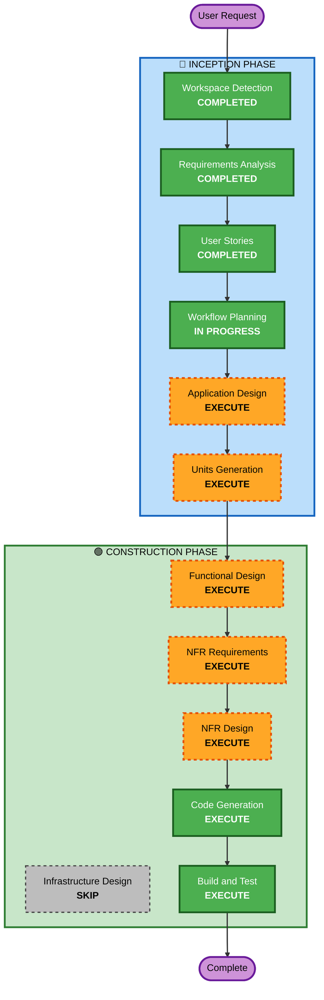

# Execution Plan - 테이블오더 서비스

## Detailed Analysis Summary

### Change Impact Assessment
- **User-facing changes**: Yes - 고객 주문 UI + 관리자 대시보드 전체 신규 개발
- **Structural changes**: Yes - 전체 시스템 아키텍처 신규 설계 (FastAPI + Vue.js + MySQL)
- **Data model changes**: Yes - 매장, 테이블, 메뉴, 주문, 사용자, 세션 등 전체 스키마 신규
- **API changes**: Yes - REST API 전체 신규 설계
- **NFR impact**: Yes - 대규모 동시 접속(500+), SSE 실시간 통신, 보안 규칙 전체 적용

### Risk Assessment
- **Risk Level**: Medium
- **Rollback Complexity**: Easy (Greenfield - 기존 시스템 없음)
- **Testing Complexity**: Complex (멀티 매장, 역할 권한, 실시간 통신, 보안)

---

## Workflow Visualization



### Text Alternative
```
Phase 1: INCEPTION
  - Workspace Detection (COMPLETED)
  - Requirements Analysis (COMPLETED)
  - User Stories (COMPLETED)
  - Workflow Planning (IN PROGRESS)
  - Application Design (EXECUTE)
  - Units Generation (EXECUTE)

Phase 2: CONSTRUCTION (per-unit)
  - Functional Design (EXECUTE)
  - NFR Requirements (EXECUTE)
  - NFR Design (EXECUTE)
  - Infrastructure Design (SKIP)
  - Code Generation (EXECUTE)
  - Build and Test (EXECUTE)
```

---

## Phases to Execute

### 🔵 INCEPTION PHASE
- [x] Workspace Detection (COMPLETED)
- [x] Requirements Analysis (COMPLETED)
- [x] User Stories (COMPLETED)
- [x] Workflow Planning (IN PROGRESS)
- [ ] Application Design - EXECUTE
  - **Rationale**: 신규 프로젝트로 컴포넌트 식별, 서비스 레이어 설계, 컴포넌트 간 의존성 정의 필요
- [ ] Units Generation - EXECUTE
  - **Rationale**: 복잡한 시스템(프론트엔드 2개 + 백엔드 + DB)으로 작업 단위 분해 필요

### 🟢 CONSTRUCTION PHASE (per-unit)
- [ ] Functional Design - EXECUTE
  - **Rationale**: 데이터 모델, API 엔드포인트, 비즈니스 로직 상세 설계 필요
- [ ] NFR Requirements - EXECUTE
  - **Rationale**: 대규모 동시 접속, SSE 실시간 통신, 보안 규칙(SECURITY-01~15) 적용 필요
- [ ] NFR Design - EXECUTE
  - **Rationale**: NFR Requirements에서 도출된 패턴을 설계에 반영 필요
- [ ] Infrastructure Design - SKIP
  - **Rationale**: 클라우드 배포 계획이 있으나, MVP 단계에서는 코드 구현에 집중. 인프라 설계는 배포 시점에 별도 진행
- [ ] Code Generation - EXECUTE (ALWAYS)
  - **Rationale**: 실제 코드 구현 필요
- [ ] Build and Test - EXECUTE (ALWAYS)
  - **Rationale**: 빌드 및 테스트 지침 필요

### 🟡 OPERATIONS PHASE
- [ ] Operations - PLACEHOLDER

---

## Success Criteria
- **Primary Goal**: 멀티 매장 테이블오더 MVP 시스템 구현
- **Key Deliverables**: FastAPI 백엔드, Vue.js 프론트엔드(고객용+관리자용), MySQL 스키마, 시드 데이터
- **Quality Gates**: 보안 규칙 준수, INVEST 기준 스토리 충족, 단위 테스트 포함
